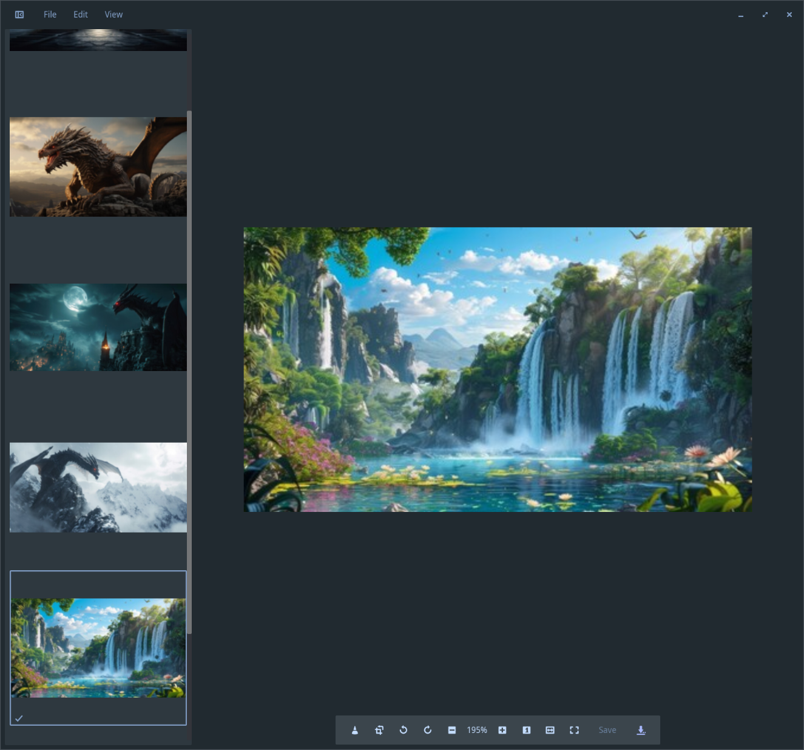
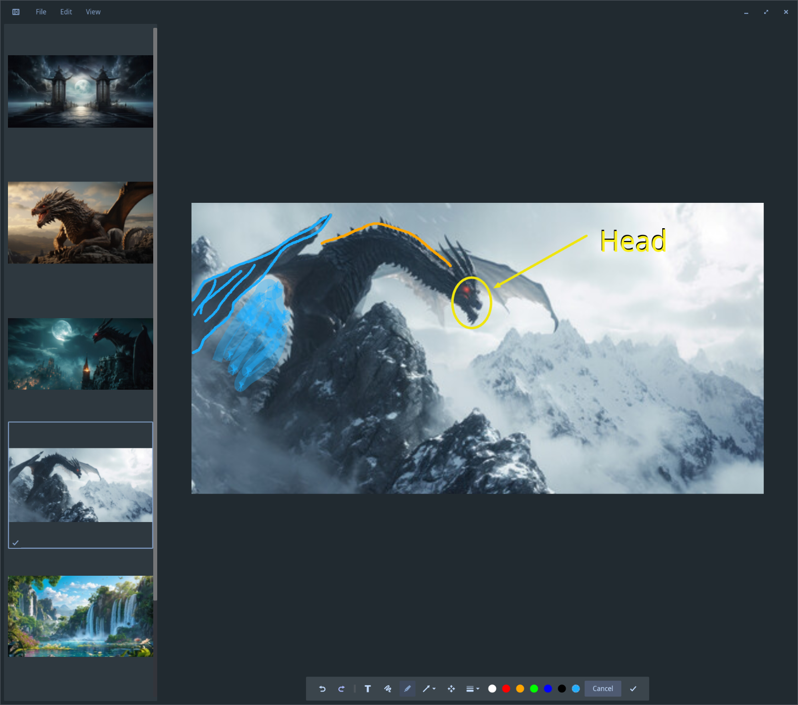
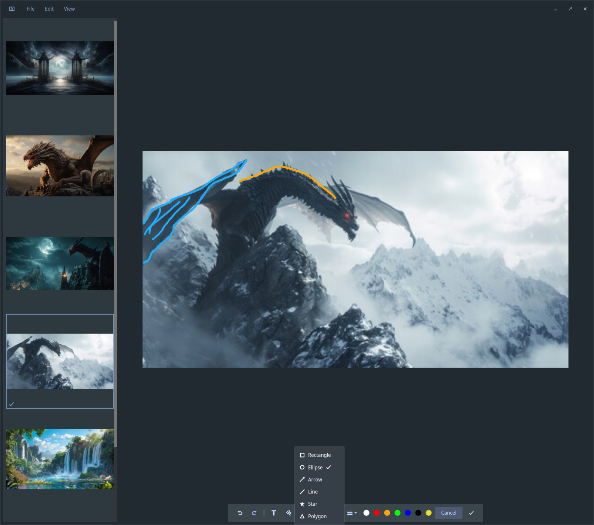
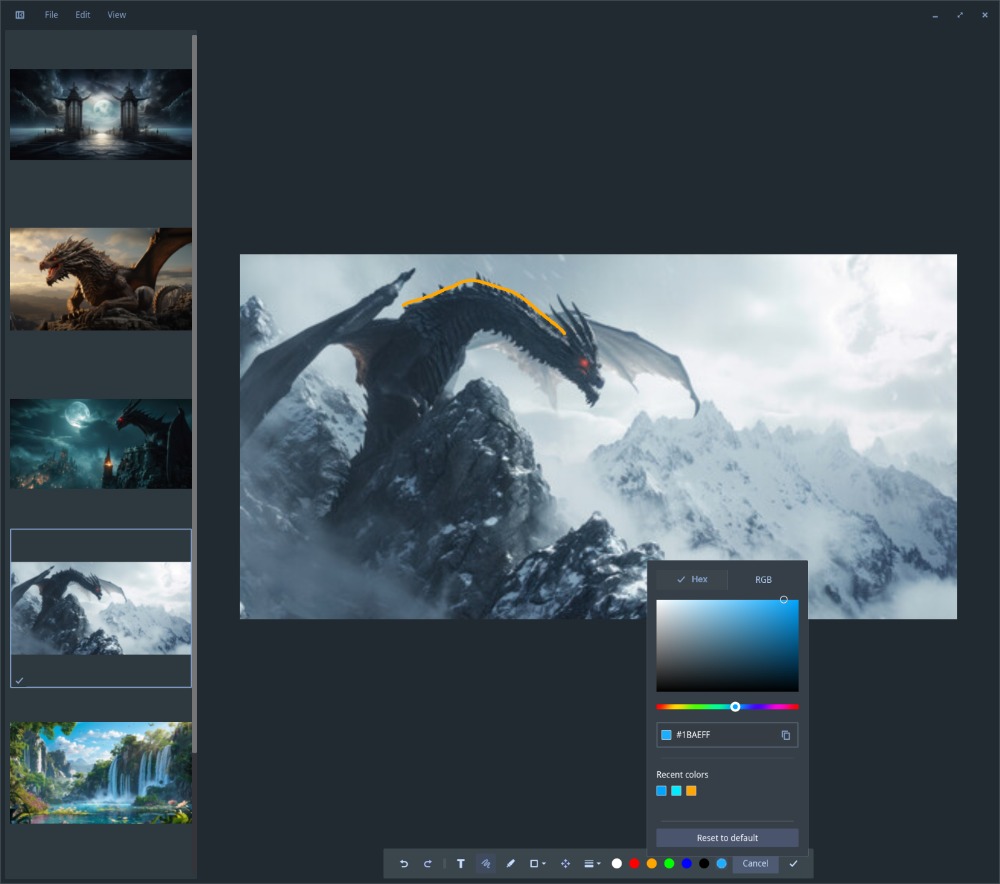
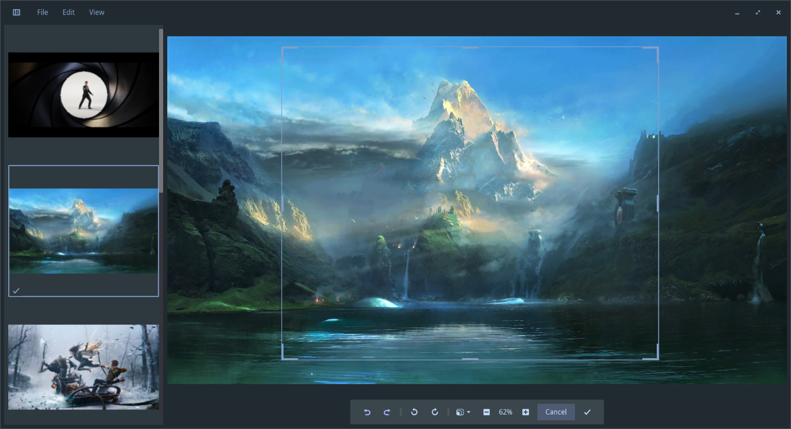
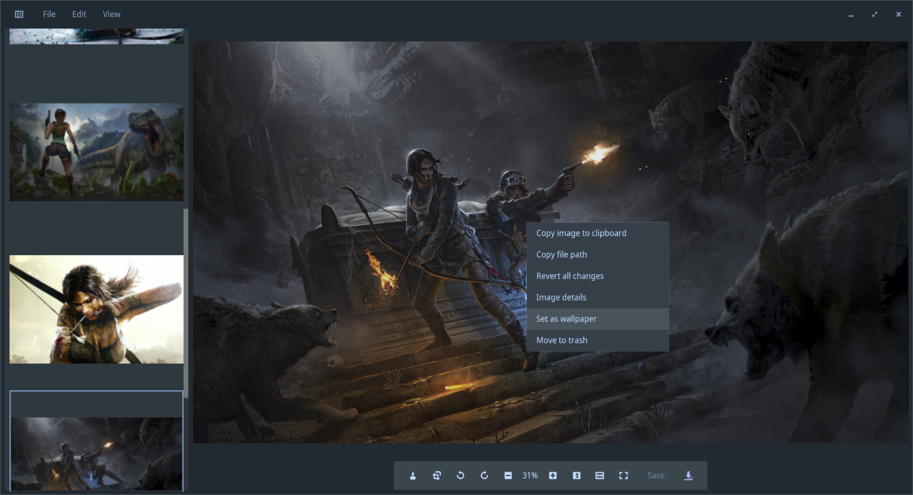

# cosmic-viewer
Image viewer for the COSMIC desktop environment.  
<br/>



COSMIC Viewer is a fast image viewer and markup tool for the COSMIC desktop
environment. It opens a wide range of formats, browses folders with a thumbnail sidebar,
and provides non-destructive editing and markup, following the
COSMIC design language with light and dark theming.  

## Features
- **Browse and view** an image or a whole folder with a thumbnail sidebar
- **Navigation** sorted by name, date, or size, with an adjustable thumbnail size
- **Viewing** with zoom, pan, fit-to-window, actual size, and fullscreen
- **EXIF-aware image details**
- **Non-destructive editing**: crop, rotate, undo/redo, and revert all
- **Annotation**: freehand pen, highlighter, shapes (rectangle, ellipse, arrow,
  line, star, polygon), and text
- **Custom colors** via a hex/RGB picker with recent colors
- **Clipboard**: copy the image or its file path
- **Save** in place
- **Save As** a new file
- **Set as wallpaper** on the current or all displays
- **Move to trash** from within the viewer

## Screenshots
| | |
|---|---|
|  |  |
| Freehand, highlighter, shapes, and text markup | Shapes: rectangle, ellipse, arrow, line, star, polygon |
|  |  |
| Custom hex/RGB colors with recent swatches | Non-destructive cropping with custom and aspect-ratio presets |
|  |  |
| Copy, image details, set as wallpaper, move to trash | Any image, set as the COSMIC desktop wallpaper |  

## Supported formats

JPEG, PNG, GIF, WebP, BMP, TIFF, ICO, AVIF, HEIF/HEIC, JPEG XL, SVG, QOI,
Radiance HDR, the Netpbm family (PPM, PGM, PBM, PNM), and Farbfeld.

## Build the project from source

```bash
# Clone the project using `git`
git clone https://github.com/pop-os/cosmic-viewer
# Change to the directory that was created
cd cosmic-viewer
# Build and run an optimized version using `just`, this may take a while
just run-release
```

## Install

```bash
# Build and install to /usr using the bundled recipe (requires `just`)
just install
```

## Community and Contributing

The COSMIC desktop environment is maintained by System76 for use in Pop!_OS. A list of all COSMIC projects can be found in the [cosmic-epoch](https://github.com/pop-os/cosmic-epoch)
project's README. If you would like to discuss COSMIC and Pop!_OS, please consider joining the [Pop!_OS Chat](https://chat.pop-os.org/). More information and links can be found on the [Pop!_OS Website](https://pop.system75.com).

## License

This project is licensed under [GPLv3](LICENSE)
